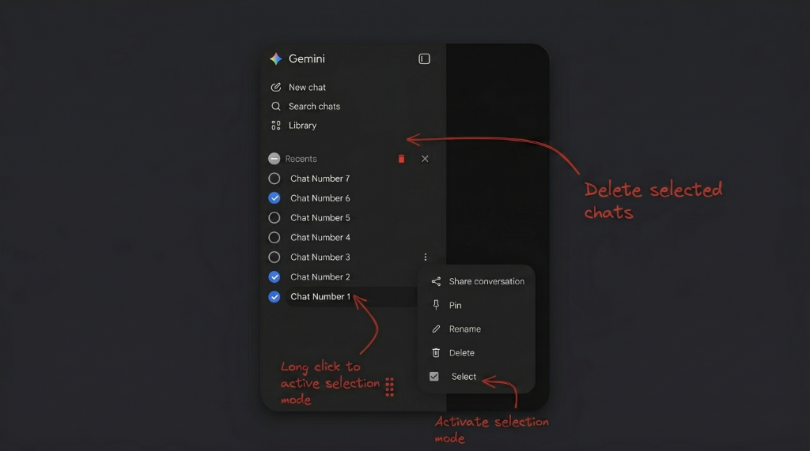
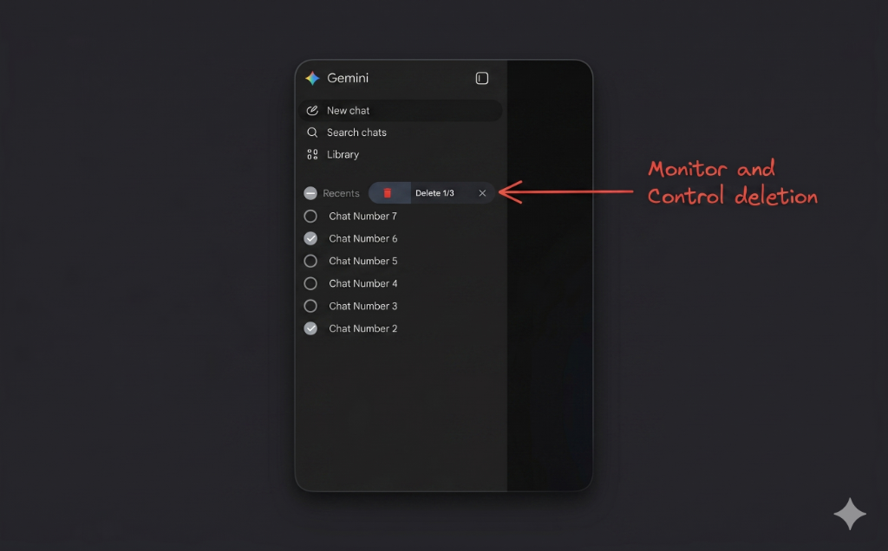

# Gemini Mass Delete

Gemini Mass Delete is a lightweight browser extension that lets you multi-select and delete multiple Gemini chat conversations in bulk with a single click. It integrates seamlessly into the Gemini sidebar interface with circular checkboxes, a "Select All" header toggle, and a long-press shortcut for quick list cleanup.

## Preview

| Selection Mode & Activation | Deletion Progress & Control |
|---|---|
|  |  |

## Features

- **Seamless Options Menu Integration**: Adds a custom **Select** / **Deselect** option directly inside the native Gemini settings dropdown for each conversation.
- **Circular Checkboxes**: Clean, responsive checkboxes placed next to each conversation in the sidebar when in selection mode.
- **"Select All" Toggle**: A checkbox at the top of the "Recents" section allows you to quickly toggle all conversations at once (with support for indeterminate/partial selection state).
- **Hold-to-Select Shortcut**: Press and hold down on any conversation list item for `600ms` to automatically enter multi-select mode and check that item.
- **Sequential Deletion Process**: Simulates manual deletion sequentially to safely remove chats from your Gemini history, bypassing any background workers or complex setups.
- **Progress Bar UI**: A clean progress indicator displays how many chats have been deleted, filling up dynamically as the process completes.
- **Abort Anytime**: Clicking the close (`X`) button during deletion stops the loop immediately and safely restores the interface.
- **No Kept Selections on Cancel**: Canceling selection mode instantly unchecks all checkboxes and resets the UI.
- **Broad Localization**: Built-in support for **35 popular languages** including English, Chinese (Simplified/Traditional), Spanish, French, German, Arabic, Hindi, Japanese, Portuguese, Russian, and many more.

## Installation

1. **Clone or Download the Repository**:
   ```bash
   git clone https://github.com/sinadalvand/GeminiMassDeleteExtension.git
   ```
   *(Or download and extract the `Gemini_Mass_Delete_Extension.zip` file).*

2. **Open Chrome Extensions Page**:
   Open Google Chrome and navigate to `chrome://extensions/`.

3. **Enable Developer Mode**:
   Toggle the **Developer mode** switch in the top-right corner.

4. **Load the Unpacked Extension**:
   Click **Load unpacked** in the top-left corner and select the `Gemini Mass Delete Extension` directory.

## Usage

1. Go to [Gemini](https://gemini.google.com/) (`https://gemini.google.com/`).
2. **Activate Selection Mode**:
   - Either click the three-dot options menu next to any conversation and select **Select**.
   - Or click and hold down (long-press) on any conversation in the sidebar for `600ms`.
3. **Select Chats**:
   - **Click Checkboxes**: Check the circular checkboxes next to the conversations you want to delete.
   - **Ctrl + A / Cmd + A**: Press `Ctrl+A` (or `Cmd+A` on Mac) when selection mode is active to quickly select all chats on the page. Pressing it again will deselect all chats.
   - **Shift + Click**: Click a checkbox to select a chat, then hold down the `Shift` key and click another chat to select the entire range of chats in between (including the clicked item). If no previous chat was selected, Shift-clicking will simply check the clicked chat.
   - **Header Toggle**: Use the **Select All** checkbox in the "Recents" header to toggle all chats at once.
4. **Delete**:
   - Click the green trash bin icon at the top of the "Recents" section to begin deleting selected chats.
   - A progress bar will show the deletion count.
5. **Cancel / Abort**:
   - Press **Escape** or click the close button (`X`) to cancel selection mode or abort an ongoing deletion.

## Project Structure

```
Gemini Mass Delete Extension/
├── manifest.json       # Extension configuration (Manifest V3)
├── assets/             # Extension icons (16px, 32px, 48px, 128px)
├── scripts/
│   ├── state.js        # Global state namespace object
│   ├── utils.js        # DOM, click, and locale translation helpers
│   ├── storage.js      # Chrome/localStorage persistence adapter
│   ├── rating.js       # Web Store rating prompt rendering and actions
│   ├── deletion.js     # Sequential chat deletion process loop
│   ├── selection.js    # Keyboard shortcuts, mouse long-press, and range selections
│   └── injector.js     # Bootstrapping entrypoint and overlay MutationObserver
├── style/
│   └── tokens.css      # Custom styles for checkboxes, buttons, and progress bar
├── _locales/           # Translation folders for 35 supported languages
├── art/                # Screenshots for documentation
└── dev/                # Development directory containing build scripts and packages
    ├── zip_extension.py # Python script to build the clean production zip
    └── Gemini_Mass_Delete_Extension.zip # Clean compiled production zip file (ignored by Git)
```

## Development & Packaging

To package a clean production build of the extension for Chrome Web Store uploads, run the Python zip script from the root of the project:
```bash
python3 dev/zip_extension.py
```
This script automatically bundles only the production-ready extension files inside `dev/Gemini_Mass_Delete_Extension.zip`. All development assets, documentation files, and git configuration files (`art/`, `dev/`, `README.md`, `LICENSE`, `.git/`, `.gitignore`, etc.) are automatically excluded to keep the package minimal.

## Contributing

Contributions, issues, and feature requests are welcome! I highly appreciate any support or contribution you want to make to help improve this extension. Feel free to open an issue or submit a pull request.

## License

This project is licensed under the MIT License.
